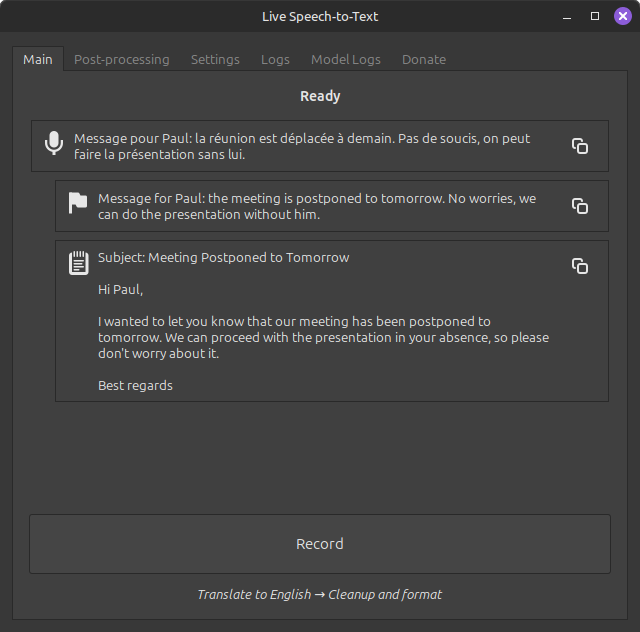
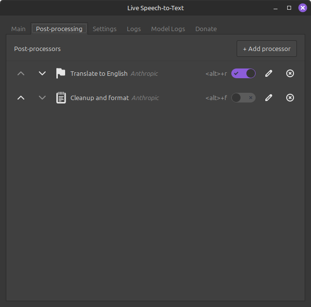
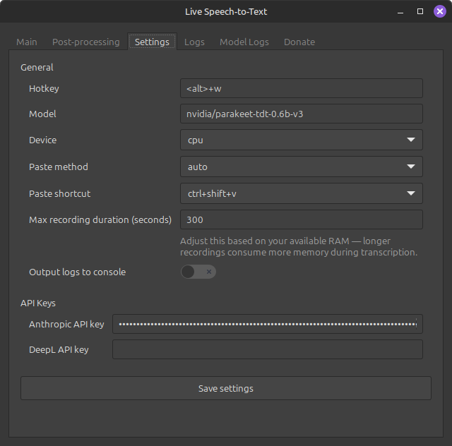

# Live Speech-to-Text

[](https://www.buymeacoffee.com/edouarddem)

A Linux desktop application that records speech from your microphone, transcribes
it locally, and pastes the result into the currently focused text field. An
optional pipeline of **post-processors** (Claude, DeepL, …) can then translate,
reformat, or otherwise rewrite the transcript before it is pasted.

Powered by [NVIDIA Parakeet TDT 0.6B v3](https://huggingface.co/nvidia/parakeet-tdt-0.6b-v3).

> [!TIP]
> This tool is particularly useful for talking to Claude Code (or any other
> coding agent) instead of typing — dictate prompts, instructions, or
> follow-up questions straight into the focused terminal or editor.



## Highlights

- 🎙️ **Local transcription** — Parakeet model runs on your machine (CPU or CUDA).
- 🔌 **Post-processor pipeline** — chain any number of LLM/translation steps,
  each with its own icon, hotkey, and on/off toggle.
- ⌨️ **Global hotkeys** — start/stop recording or toggle individual processors
  without touching the mouse.
- 🖥️ **GTK 3 GUI + system tray** — the window can be hidden to the tray; the
  tray icon colour reflects the current state.
- 🕒 **Recording time-cap** — configurable maximum duration with a live
  countdown on the Stop button.
- 🔐 **Encrypted secrets** — Anthropic / DeepL API keys are stored encrypted in
  the config file.

## Installation

### Quick install

```bash
./install.sh
```

To remove:

```bash
./uninstall.sh
```

### Step by step

#### 1. System packages (Debian / Ubuntu)

```bash
# Audio capture
sudo apt install libportaudio2

# GTK 3 Python bindings
sudo apt install python3-gi python3-gi-cairo gir1.2-gtk-3.0

# Text insertion (X11)
sudo apt install xdotool xclip

# Text insertion (Wayland — instead of xdotool/xclip)
# sudo apt install wl-clipboard wtype
```

#### 2. Python

Python ≥ 3.10 is required. Create a virtual environment with access to system
site-packages (required for the GTK bindings):

```bash
python3 -m venv .venv --system-site-packages
source .venv/bin/activate
```

If you already have a virtual environment, enable system site-packages by
setting `include-system-site-packages = true` in `.venv/pyvenv.cfg`.

#### 3. Install the package

```bash
pip install -e .
```

## Usage

```bash
# Quick start (activates the virtual environment automatically)
./start.sh
```

If the virtual environment is already activated:

```bash
live-stt
```

## How it works

1. Press the global hotkey (default **`<alt>+w`**) — or click **Record** in the
   GUI — to start recording.
2. Press it again — or click **Stop** — to end the recording. The button shows
   a live countdown to the max recording duration (default 5 min).
3. Audio is transcribed locally with Parakeet.
4. Every **enabled** post-processor runs in order, each producing a new history
   card.
5. The final text is pasted into whatever input field has focus; intermediate
   results stay visible in the history.

### System tray

Closing the window hides it to the tray — right-click the tray icon and select
**Quit** to exit completely. The tray colour reflects what the app is doing:

| Tray colour | State        |
| ----------- | ------------ |
| Grey        | Idle         |
| Red         | Recording    |
| Orange      | Transcribing |
| Blue        | Processing (post-processor pipeline running) |

## Post-processors

The **Post-processing** tab manages an ordered list of processors. Each entry is
a small recipe:

- **Provider** — `anthropic` (Claude) or `deepl`.
- **Name** & **Icon** — shown in the Main tab toggle row and in the history.
- **Hotkey** _(optional)_ — toggle this processor on/off without opening the GUI.
- **Provider-specific fields** — e.g. Claude prompt + model + max tokens, or
  DeepL target language.
- **Enabled** switch.

Two processors are seeded by default the first time the app runs:

1. **Translate to English** — Claude Haiku, hotkey `<alt>+t`, disabled by default.
2. **Cleanup and format** — Claude Haiku, rewrites the transcription as a clean
   email; hotkey `<alt>+f`, disabled by default.



## Settings

All settings live in the **Settings** tab and persist to
`~/.config/live-stt/config.yaml`. Encrypted fields are decrypted in memory and
re-encrypted on save.

### General

| Setting                  | Default                       | Description                                     |
| ------------------------ | ----------------------------- | ----------------------------------------------- |
| `hotkey`                 | `<alt>+w`                     | Global record / stop hotkey (pynput format)     |
| `model_name`             | `nvidia/parakeet-tdt-0.6b-v3` | HuggingFace model identifier                    |
| `device`                 | `auto`                        | `auto`, `cpu`, or `cuda`                        |
| `paste_method`           | `auto`                        | `auto`, `xclip`, `xdotool`, `wayland`           |
| `paste_shortcut`         | `ctrl+shift+v`                | Shortcut emitted to paste into the focused app  |
| `max_recording_seconds`  | `300`                         | Hard ceiling — recording auto-stops at this point |
| `log_to_console`         | `false`                       | Mirror application logs to stdout               |

> [!NOTE]
> Increase `max_recording_seconds` only if you have RAM to spare — longer
> audio buffers cost more memory during transcription.

### API keys

| Setting             | Default | Description                            |
| ------------------- | ------- | -------------------------------------- |
| `anthropic_api_key` |         | Anthropic API key (stored encrypted)   |
| `deepl_api_key`     |         | DeepL API key (stored encrypted)       |

Anthropic models are listed [here](https://platform.claude.com/docs/en/about-claude/models/overview).



## Hotkeys

Hotkeys use [pynput's format](https://pynput.readthedocs.io/en/latest/keyboard.html#pynput.keyboard.HotKey).
Modifier names (`ctrl`, `shift`, `alt`, `cmd`, `super`, function keys, arrows…)
must be wrapped in chevrons; the GUI normalises this for you, so typing
`ctrl+shift+t` is automatically saved as `<ctrl>+<shift>+t`.

| Default        | Action                                          |
| -------------- | ----------------------------------------------- |
| `<alt>+w`      | Toggle recording                                |
| `<alt>+t`      | Toggle the **Translate to English** processor   |
| `<alt>+f`      | Toggle the **Cleanup and format** processor     |

Per-processor hotkeys are configured in the post-processor editor.

## Supported languages

Parakeet v3 auto-detects the spoken language. Supported:
`bg`, `cs`, `da`, `de`, `el`, `en`, `es`, `et`, `fi`, `fr`, `hr`, `hu`, `it`,
`lt`, `lv`, `mt`, `nl`, `pl`, `pt`, `ro`, `ru`, `sk`, `sl`, `sv`, `uk`.

## License

See [LICENSE](LICENSE).
